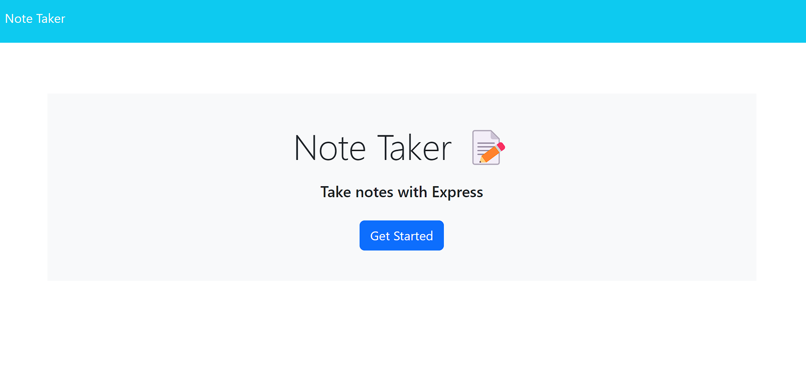

# new-note-taker

## Description

This application is an easy and convenient way to take notes and have them in an accessible place.

## Table of Contents

If your README is long, add a table of contents to make it easy for users to find what they need.

- [Technologies Used](#technologies-used)
- [Installation](#installation)
- [Usage](#usage)
- [Credits](#credits)
- [License](#license)

## Technologies Used

 	  	

## Installation

- NodeJS
- MySQL

## Usage

Click on the note title to give the note a title. Then add whatever neccessary information to the note. To save it, select "Save Note", a button that appears once the title and and text area have been filled. You can reopen previous notes by selecting them from the left-hand side. If a note is currently open, a new note can be created by selecting "New Note".

Website: https://new-notes-express-5e318c5f0602.herokuapp.com/

## Credits

Starter code from miniature-eureka.

## License

MIT License
